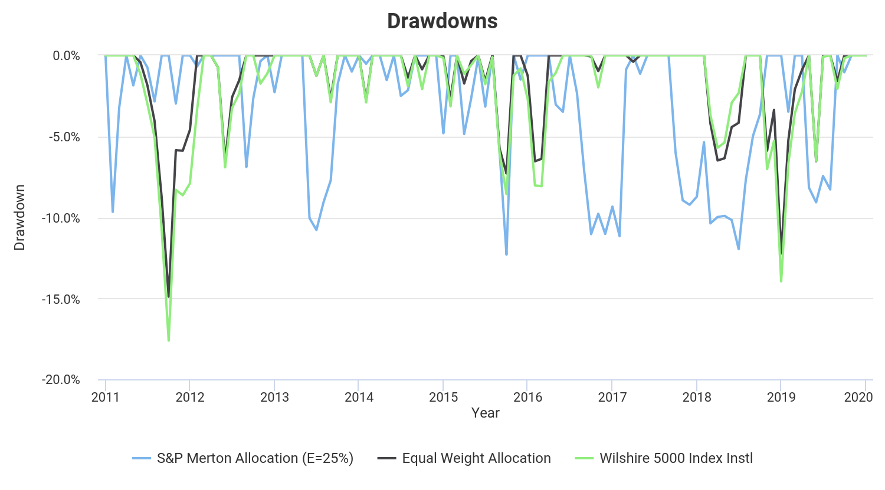

# Efficient Portfolio Construction

This is a Google Colaboratory (Jupyter notebook) implementation of [Robert C. Merton](https://en.wikipedia.org/wiki/Robert_C._Merton)'s efficient portfolio algorithm from the paper *An Analytic Derivation of the Efficient Portfolio Frontier* (1972).

In the paper, Merton identifies an algorithm that, given historical returns data from several identified securities, constructs a portfolio with the <ins>lowest variance in returns for a given level of expected returns</ins> (this is the "efficiency").

The algorithm outputs the fraction of the portfolio to be allocated to each security. Each may be positive or negative corresponding to long and short positions, or zero when no position should be taken. They are guaranteed to sum to 100%.

The linked notebook as written returns such a portfolio using some or all constituents of the S&P 100 index with available returns data from 2010-2019. You must specify the level of expected returns at which to perform the allocation.

**Keep in mind the portfolio is only efficient for time periods with available returns data. The results are not forward-looking, nor are they advice to buy or sell any security.**

Assumed total annual return: `25.0%.`

|Symbol|Port%   |
|------|--------|
|MRK   |0.397   |
|AMT   |0.378   |
|VZ    |0.320   |
|MO    |0.177   |
|BRK-B |0.174   |
|DHR   |0.171   |
|MCD   |0.169   |
|SBUX  |0.144   |
|BMY   |0.144   |
|ALL   |0.125   |
|T     |0.123   |
|UNH   |0.118   |
|AAPL  |0.115   |
|BA    |0.107   |
|HD    |0.087   |
|WBA   |0.078   |
|ORCL  |0.076   |
|C     |0.065   |
|BLK   |0.064   |
|EMR   |0.064   |
|MA    |0.059   |
|KO    |0.053   |
|JNJ   |0.050   |
|BAC   |0.050   |
|SO    |0.045   |
|EXC   |0.042   |
|COF   |0.040   |
|ABT   |0.038   |
|UPS   |0.038   |
|V     |0.038   |
|DUK   |0.037   |
|LOW   |0.028   |
|DD    |0.027   |
|FDX   |0.027   |
|NFLX  |0.023   |
|RTX   |0.022   |
|AMGN  |0.021   |
|CVX   |0.020   |
|CRM   |0.020   |
|GOOG  |0.016   |
|MS    |0.015   |
|PM    |0.014   |
|ADBE  |0.013   |
|WFC   |0.012   |
|OXY   |0.010   |
|BKNG  |0.008   |
|TXN   |0.005   |
|GOOGL |0.004   |
|QCOM  |0.000   |
|SLB   |0.000   |
|PFE   |-0.005  |
|LMT   |-0.008  |
|AIG   |-0.009  |
|BK    |-0.009  |
|GE    |-0.009  |
|CMCSA |-0.010  |
|INTC  |-0.011  |
|HON   |-0.017  |
|NEE   |-0.018  |
|CVS   |-0.020  |
|GILD  |-0.023  |
|F     |-0.024  |
|SPG   |-0.024  |
|NKE   |-0.024  |
|AMZN  |-0.027  |
|MMM   |-0.029  |
|USB   |-0.030  |
|GS    |-0.031  |
|TMO   |-0.032  |
|TGT   |-0.034  |
|MSFT  |-0.034  |
|GM    |-0.035  |
|CHTR  |-0.039  |
|UNP   |-0.040  |
|NVDA  |-0.042  |
|BIIB  |-0.050  |
|LLY   |-0.058  |
|JPM   |-0.064  |
|WMT   |-0.066  |
|GD    |-0.071  |
|MDLZ  |-0.072  |
|MDT   |-0.072  |
|MET   |-0.080  |
|ACN   |-0.085  |
|CSCO  |-0.105  |
|PEP   |-0.106  |
|CL    |-0.110  |
|PG    |-0.114  |
|IBM   |-0.121  |
|COP   |-0.132  |
|XOM   |-0.132  |
|CAT   |-0.139  |
|DIS   |-0.165  |
|AXP   |-0.195  |
|COST  |-0.352  |

If $10,000 was invested with that allocation (and rebalanced monthly) between January 2011 and December 2019 the portfolio would have had the following returns:

